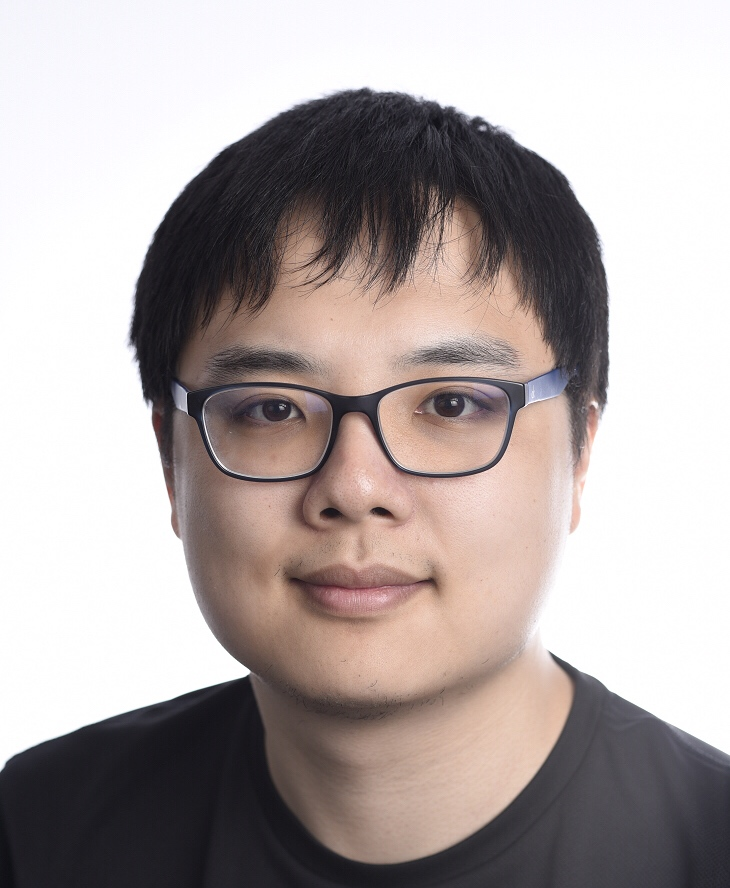

# EACL2023_Tutorial_Dialogue_Summarization

  

Materials for [EACL2023](https://2023.eacl.org/) tutorial: Summarization of Dialogues and Conversations At Scale

## Time and Location

1. Time: ??am - ??pm (GMT+?), May 6???, 2023.

2. Location: ?????

3. Live Stream on Zoom: [Link??]

## Tutorial Abstract 
Conversations are the natural communication format for people. This fact has motivated the large body of question answering and chatbot research as a seamless way for people to interact with machines. The conversations between people however, captured as video, audio or private or public written conversations, largely remain untapped as a source of compelling starting point for developing language technology. Summarizing such conversations can be enormously beneficial: automatic minutes for meetings or meeting highlights sent to relevant people can optimize communication in various groups while minimizing demands on people’s time; similarly analysis of conversations in online support groups can provide valuable information to doctors about the patient concerns.
Summarizing written and spoken conversation poses unique research challenges—text reformulation, discourse and meaning analysis beyond the sentence, collecting data, and proper evaluation metrics. All these have been revisited by re- searchers since the emergence of neural approaches as the dominant approach for solving language processing problems. In this tutorial, we will survey the cutting-edge methods for summarization of conversations, covering key sub-areas whose combination is needed for a successful solution.

## Tutorial Materials

**1. Slides** [\[Introduction\]](https://github.com/zcgzcgzcg1/WSDM2023_Knowledge_NLP_Tutorial/blob/main/files/PART1_Introduction.pdf) [\[PretrainingAndModeling\]](https://github.com/zcgzcgzcg1/WSDM2023_Knowledge_NLP_Tutorial/blob/main/files/PART2_Knowledge_in_NLU.pdf))

**2. Video** Available after the tutorial

**3. Survey:** 

- A Survey on Dialogue Summarization: Recent Advances and New Frontiers, in IJCAI 2021. [\[PDF\]](https://arxiv.org/pdf/2107.03175.pdf)

**4. Reading list:**

- A Hierarchical Network for Abstractive Meeting Summarization with Cross-Domain Pretraining, in Findings of EMNLP 2020. [\[pdf\]](https://aclanthology.org/2020.findings-emnlp.19.pdf) 

## Tutorial schedule (Tentative)

| Local time (GMT+8??) | Content | Presenter | Slides |
| :---: | :---: | :---: | :---: |
| 09:00-10:00 | Introduction to Conversation Summarization | Diyi Yang | [\[Slides??\]](https://github.com/zcgzcgzcg1/WSDM2023_Knowledge_NLP_Tutorial/blob/main/files/PART1_Introduction.pdf) |
| 10:00-10:55 | Pretraining and Modeling | Chenguang Zhu [\[Slides??\]](https://github.com/zcgzcgzcg1/WSDM2023_Knowledge_NLP_Tutorial/blob/main/files/PART4_Knowledge_in_NLG.pdf) |
| 11:05-12:00 | Evaluation and Challenges | Diyi Yang | [\[Slides??\]](https://github.com/zcgzcgzcg1/WSDM2023_Knowledge_NLP_Tutorial/blob/main/files/PART5_Conclusion.pdf) |

## Presenters

## &nbsp;  &nbsp; &nbsp;  &nbsp;  

Diyi Yang &nbsp; &nbsp; &nbsp; Chenguang Zhu &nbsp; &nbsp; &nbsp; 

** [Diyi Yang](https://cs.stanford.edu/~diyiy/)** is an assistant professor in the Computer Science Department at Stanford University. Her research focuses on dialogue summarization, learning with limited and noisy text data, user-centric language generation, and computational social science. Diyi has organized four workshops at NLP conferences: Widening NLP Workshops at NAACL 2018 and ACL 2019, Casual Inference workshop at EMNLP 2021, and NLG Evaluation workshop at EMNLP 2021. She also gave a tutorial at ACL 2022 on Learning with Limited Data.

** [Chenguang Zhu](https://www.microsoft.com/en-us/research/people/chezhu/)** is a Principal Research Manager in Microsoft Cognitive Services Research Group, where he leads the Knowledge & Language Team. His research in NLP covers dialogue summarization, knowledge graph, prompt learning and multimodal learning. He has led teams to achieve first places in multiple NLP competitions, including CommonsenseQA, CommonGen, FEVER, CoQA, ARC and SQuAD v1.0. He holds a Ph.D. degree in Computer Science from Stanford University. Dr. Zhu has held Tutorial on Knowledge-Augmented NLP Methods at ACL 2022 and WSDM 2023, as well as the Workshop of Knowledge-Augmented NLP Methods at AAAI 2023.
